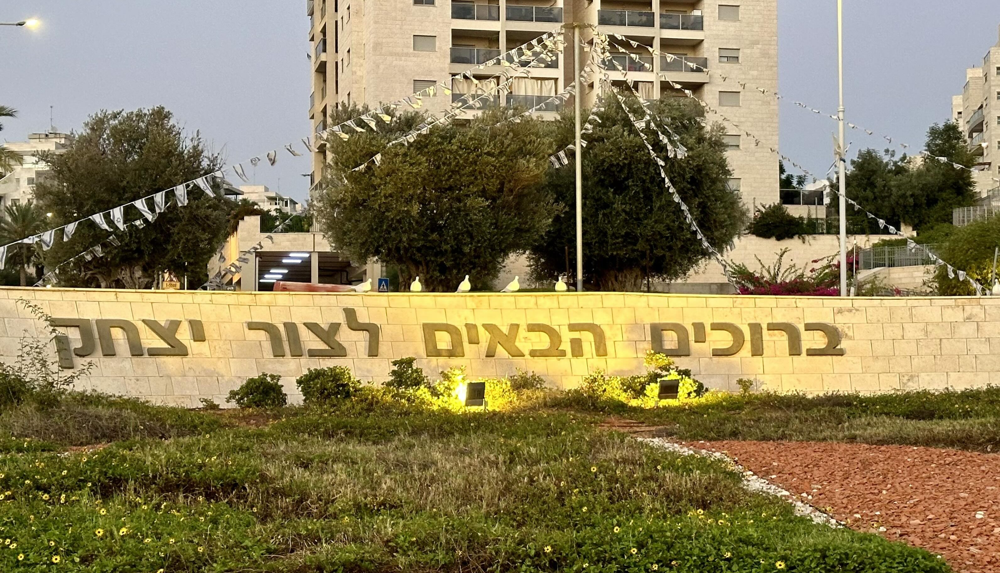

# Welcome to Tzur Yitzhak! (ברוכים הבאים לצור יצחק)

**Mon 08 July 2024** - Welcome to the very first blog post on this site, `user`. Here, various content will be published, mainly related to the daily life of Tzur Yitzhak. I like to call it - Tzur Yitzhak City. Tzur Yitzhak City is a beautiful place, with nice (not always, and not all) people, located in [Drom HaSharon Regional Council](https://www.dsharon.org.il/) and has a population of around 7,080 people, according to [Wikipedia](https://en.wikipedia.org/wiki/Tzur_Yitzhak). But I'm not sure, I think it's more now.

<!-- more -->

## The Motivation
There are a lot of things that I like about Tzur Yitzhak and its people, and some that I do not. All of that will be carefully documented and published. No specific motivation - just for fun.

## whoami
About the author: I've been living here for more than five long years, and I have a wife and kids. I like to code, and that's my main business in life. In my free time, I like to hack, but unfortunately for me, I don't have a lot of time for my tiny hobby lately - you know, need to pay the bills.

Sincerely yours -- Faraday.